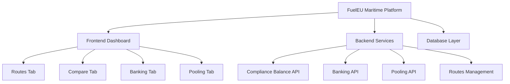

# ⚓ FuelEU Maritime — Full-Stack Compliance Platform 🌍🚢⚙️


---

## 🌟 Overview

**FuelEU Maritime** is a full-stack compliance management platform developed to simulate and manage greenhouse gas (GHG) emission compliance under the **FuelEU Maritime Regulation (EU 2023/1805)**.

The platform allows users to view, compare, and compute compliance balances for maritime routes, and to simulate **banking** and **pooling** operations following EU regulatory standards.

This project demonstrates strong architectural clarity, backend–frontend synchronization, and modular implementation using **Clean (Hexagonal) Architecture** principles.

---

## 🎯 Objective

To design and implement a minimal yet structured **FuelEU Maritime Compliance Platform** that includes:

- Frontend dashboard for **Routes**, **Compare**, **Banking**, and **Pooling** modules  
- Backend APIs for managing routes, compliance balances, and financial logic  
- Domain-driven, maintainable code with TypeScript, React, and Node.js

---



## ✨ Key Features

### 🛣️ Routes Management
- Display all available maritime routes  
- Filter by **vessel type**, **fuel type**, and **year**  
- Select and set a **baseline route** for emission comparisons  

### 📊 Comparison Dashboard
- Compare baseline vs other routes  
- Display **GHG intensity**, **percent difference**, and **compliance status**  
- Graphical visualization of baseline vs comparison values  

### 💰 Banking System (Article 20)
- Calculate **Compliance Balance (CB)** for each ship  
- **Bank surplus** when emissions are below target  
- **Apply** banked surplus to offset deficits  
- Validation to prevent invalid transactions  

### 🤝 Pooling System (Article 21)
- Create pools where multiple ships share CBs  
- Ensure no ship exits with a worse CB value  
- Maintain fairness and total CB ≥ 0  

---

## ⚙️ Technology Stack

### 🖥️ Frontend
- React.js + TypeScript + Vite  
- Tailwind CSS (for modern UI design)  
- Context API for state management  
- Chart.js / Recharts for data visualization  
- RESTful API integration  

### 🧩 Backend
- Node.js + Express + TypeScript  
- PostgreSQL with **Prisma ORM**  
- Hexagonal (Ports & Adapters) architecture  
- Jest & Supertest for testing  
- ESLint + Prettier for clean code  

---

## 🧱 Project Architecture

```text
shahab-16-fueleu_compliance_platform/
│
├── README.md
├── AGENT_WORKFLOW.md
├── REFLECTION.md
│
├── backend/
│   ├── jest.config.js
│   ├── package.json
│   ├── tsconfig.json
│   ├── .eslintrc.js
│   ├── prisma/
│   │   └── schema.prisma
│   ├── scripts/
│   │   └── seed.js
│   ├── src/
│   │   ├── prismaClient.ts
│   │   ├── adapters/
│   │   │   ├── inbound/http/
│   │   │   │   ├── bankingController.ts
│   │   │   │   ├── complianceController.ts
│   │   │   │   ├── poolsController.ts
│   │   │   │   └── routeController.ts
│   │   │   └── outbound/prisma/
│   │   │       ├── BankRepositoryPrisma.ts
│   │   │       ├── PoolRepositoryPrisma.ts
│   │   │       └── RouteRepositoryPrisma.ts
│   │   ├── core/
│   │   │   ├── application/usecases/
│   │   │   │   ├── banking.ts
│   │   │   │   ├── computeCB.ts
│   │   │   │   └── createPool.ts
│   │   │   └── domain/entities/
│   │   │       └── Route.ts
│   │   ├── infrastructure/server/
│   │   │   ├── app.ts
│   │   │   └── dev.ts
│   │   └── shared/constants.ts
│   └── tests/
│       ├── integration/
│       │   ├── routes.integration.test.js
│       │   └── routes.integration.test.ts
│       └── unit/
│           ├── computeCB.test.js
│           ├── computeCB.test.ts
│           ├── createPool.test.js
│           └── createPool.test.ts
│
└── frontend/
    ├── index.html
    ├── package.json
    ├── tsconfig.json
    ├── vite.config.ts
    ├── src/
    │   ├── adapters/
    │   │   ├── infrastructure/
    │   │   │   ├── apiClient.ts
    │   │   │   └── fetchHelpers.ts
    │   │   └── ui/
    │   │       ├── AppRouter.tsx
    │   │       ├── components/
    │   │       │   ├── Card.tsx
    │   │       │   ├── Sidebar.tsx
    │   │       │   └── Topbar.tsx
    │   │       └── pages/
    │   │           ├── BankingPage.tsx
    │   │           ├── ComparePage.tsx
    │   │           ├── DashboardPage.tsx
    │   │           ├── PoolingPage.tsx
    │   │           └── RoutesPage.tsx
    │   ├── core/
    │   │   ├── application/usecases/
    │   │   │   └── compute.ts
    │   │   └── domain/
    │   │       ├── Banking.ts
    │   │       └── Route.ts
    │   └── shared/constants.ts

```

## 🧮 Core Formula

### Compliance Balance (CB)

CB = (Target - Actual) × (Fuel Consumption × 41,000 MJ/t)


- **Target (2025):** 89.3368 gCO₂e/MJ  
- **Positive CB:** surplus → can bank or pool  
- **Negative CB:** deficit → must offset via banked or pooled surplus  

---

## 🌐 API Endpoints

### 🚢 Routes
| Endpoint | Method | Description |
|---|---:|---|
| `/routes` | GET | Fetch all routes |
| `/routes/:id/baseline` | POST | Set a route as baseline |
| `/routes/comparison` | GET | Compare baseline with others |

### ⚖️ Compliance
| Endpoint | Method | Description |
|---|---:|---|
| `/compliance/cb?shipId&year` | GET | Compute CB snapshot |
| `/compliance/adjusted-cb` | GET | Return adjusted CB after banking |

### 💳 Banking
| Endpoint | Method | Description |
|---|---:|---|
| `/banking/bank` | POST | Bank positive CB |
| `/banking/apply` | POST | Apply banked surplus |

### 🤝 Pooling
| Endpoint | Method | Description |
|---|---:|---|
| `/pools` | POST | Create pool with multiple ships |
| `/pools` | GET | Retrieve pool details |

---

## 📊 Sample Dataset

| Route ID | Vessel Type | Fuel Type | Year | GHG Intensity | Fuel (t) | Distance (km) | Emissions (t) |
|---:|---|---|---:|---:|---:|---:|---:|
| R001 | Container | HFO | 2024 | 91.0 | 5000 | 12000 | 4500 |
| R002 | BulkCarrier | LNG | 2024 | 88.0 | 4800 | 11500 | 4200 |
| R003 | Tanker | MGO | 2024 | 93.5 | 5100 | 12500 | 4700 |
| R004 | RoRo | HFO | 2025 | 89.2 | 4900 | 11800 | 4300 |
| R005 | Container | LNG | 2025 | 90.5 | 4950 | 11900 | 4400 |


## 🧪 Testing

| Test Type | Framework | Description |
|---|---|---|
| Unit Tests | Jest | Tests computation of CB, banking, and pooling |
| Integration Tests | Supertest | Validates backend endpoints |
| Data Tests | Prisma | Ensures schema & seed integrity |
| Edge Cases | Manual | Tests invalid and boundary conditions |

---

## 🚀 Getting Started

### Clone Repository
```bash
git clone https://github.com/yourusername/shahab-16-fueleu_compliance_platform.git
cd shahab-16-fueleu_compliance_platform
```

### Backend Setup

```bash
cd backend
npm install
cp .env.example .env     # Add PostgreSQL credentials
npm run dev
```


## Frontend Setup
```bash
cd ../frontend
npm install
npm run dev
```

## Run Tests
```bash
npm run test
```


---

## 🧭 Evaluation Criteria

| Area | Focus |
|---|---|
| Architecture | Clean hexagonal pattern, modular design |
| Functionality | Routes, Compare, Banking, Pooling modules implemented |
| Code Quality | TypeScript strict mode, linted and formatted |
| Testing | Unit & integration tests implemented and passing |
| Documentation | Clear, complete, and consistent README, plus AGENT_WORKFLOW.md & REFLECTION.md |
| Robustness | Proper validation, edge-case handling, and defensive programming |

---

## 📘 Reference

This project follows principles and calculation methods inspired by:

- **FuelEU Maritime Regulation (EU) 2023/1805**, particularly **Annex IV** and **Articles 20–21**.
- Core calculation:  
  `CB = (Target - Actual) × (Fuel Consumption × 41,000 MJ/t)`  
  where **Target (2025)** = `89.3368 gCO₂e/MJ`.

For formal regulatory details consult the official EU legislation and technical guidance documents.

---

## 📝 Notes & Next Steps (suggested)

- Add seed data to `prisma/seed.js` using the sample dataset provided above.  
- Implement unit tests for `computeCB`, `createPool`, and banking flows.  
- Harden API validation (request schemas, error handling).  
- Add sample Postman collection or curl examples for quick API verification.  
- Optionally add a short `CHANGELOG.md` for project progress tracking.

---

## 🧾 License

This repository is provided for demonstration/assignment purposes. Add a license suitable for your use (e.g., `MIT`) in a `LICENSE` file if you plan to share publicly.

---

## 👨‍💻 Author

**MD Shahab Uddin**  
Full-Stack Developer  
GitHub: https://github.com/Shahab-16

---
